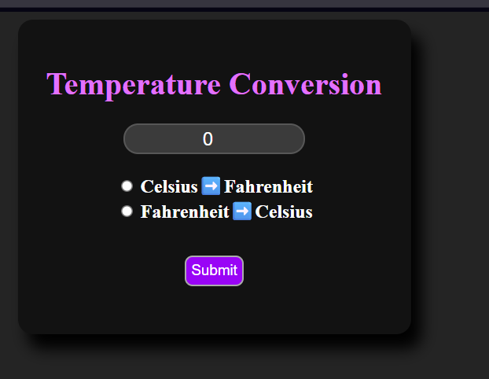

# 🌡️ Temperature Converter

A simple and interactive Temperature Converter built using **HTML**, **CSS**, and **Vanilla JavaScript**. This application allows users to convert temperatures between **Celsius** and **Fahrenheit** with a clean and beginner-friendly interface.

## 📸 Preview



> Save a screenshot of your application as **preview.png** inside this project's folder.

---

## ✨ Features

- 🌡️ Convert Celsius to Fahrenheit
- ❄️ Convert Fahrenheit to Celsius
- ⚡ Instant conversion
- 🎨 Clean and responsive user interface
- 💻 Built using HTML, CSS, and JavaScript

---

## 🛠️ Technologies Used

- HTML5
- CSS3
- JavaScript (ES6)

---

## 📂 Project Structure

```text
Temperature-Converter/
├── index.html
├── style.css
├── index.js
├── README.md
└── preview.png
```

---

## 🚀 Getting Started

1. Clone the repository:

```bash
git clone https://github.com/vaibhavsunilsarda37/Temperature-Converter.git
```

2. Open the project folder.

3. Open `index.html` in your browser.

---

## 📚 What I Learned

- DOM Manipulation
- JavaScript Functions
- Event Handling
- Conditional Statements (`if...else`)
- Reading User Input
- CSS Styling

---

## 🔮 Future Improvements

- Add Kelvin conversion
- Improve mobile responsiveness
- Better input validation
- Dark mode
- Smooth animations

---

## 👨‍💻 Author

**Vaibhav Sarda**

GitHub: **https://github.com/vaibhavsunilsarda37**

---

⭐ If you like this project, consider giving it a **Star** on GitHub!